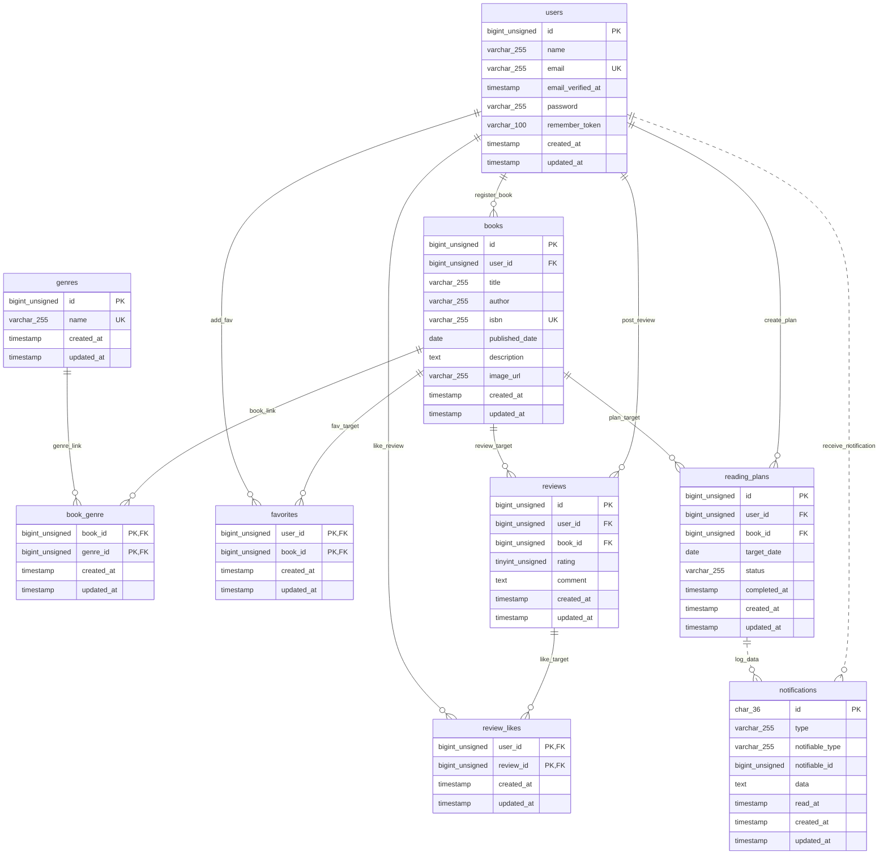

# BookShelf 書籍レビューアプリ

書籍レビューの機能を実装したLaravelプロジェクトです。一般ユーザーが書籍の登録・閲覧、レビュー投稿、お気に入り登録や読書計画の管理を行え、外部連携用の公開REST APIを搭載しています。

#### 作成者

氏名 谷口俊明

#### 使用技術

- PHP 8.5
- Laravel 10.x
- MySQL 8.4
- Docker / Docker Compose / Laravel Sail
- Vite / Tailwind CSS 3.4 / @tailwindcss/forms / Alpine.js
- Laravel Fortify（認証）
- Laravel Sanctum（API認証）
- phpMyAdmin

#### ER図



#### 開発環境URL

- Webアプリケーション: http://localhost
- phpMyAdmin: http://localhost:8080
    - ユーザー名: `sail`
    - パスワード: `password`

#### 動作環境

- Docker
- Docker Compose
  ※ Windowsの場合はWSL2の利用を推奨します。

#### 環境構築手順

1. **リポジトリをクローン**

```bash
git clone https://github.com/alienworldadventurer-debug/bookshelf-app.git
cd bookshelf-app
```

2. **.envファイルの準備**
   .env.example をコピーして .env を作成します。

```bash
cp .env.example .env
```

.env ファイルを開き、以下のDB接続情報（Sailコンテナ内のMySQL指定）になっているか確認・設定します。

```ini
DB_CONNECTION=mysql
DB_HOST=mysql
DB_PORT=3306
DB_DATABASE=laravel
DB_USERNAME=sail
DB_PASSWORD=password
```

3. **Composer依存パッケージのインストールとSailコンテナの起動**
   初回クローン時は `vendor` ディレクトリが存在せず `./vendor/bin/sail` コマンドが使えないため、まず以下のDockerコマンドで `composer install` を実行し、その後にSailコンテナを起動します。

```bash
# 初回のみ：Dockerコンテナで composer install を実行（vendorディレクトリの作成）
docker run --rm \
    -u "$(id -u):$(id -g)" \
    -v "$(pwd):/var/www/html" \
    -w /var/www/html \
    laravelsail/php82-composer:latest \
    composer install --ignore-platform-reqs

# Sailコンテナの起動
./vendor/bin/sail up -d
```

4. **アプリケーションキーの生成**

```bash
./vendor/bin/sail artisan key:generate
```

5. **データベースマイグレーションおよび初期データの投入（シーディング）**

```bash
./vendor/bin/sail artisan migrate:fresh --seed
```

6. **フロントエンドのセットアップとビルド**

```bash
./vendor/bin/sail npm install
./vendor/bin/sail npm run build
```

7. **アプリケーションへのアクセス**
   ブラウザで [http://localhost](http://localhost) にアクセスします。

#### テスト実行

```bash
./vendor/bin/sail artisan test
```

カバレッジ付きで実行する場合:

```bash
./vendor/bin/sail artisan test --coverage
```

コード規約テスト（Laravel Pint）を実行する場合:

```bash
./vendor/bin/sail bin pint --test
```

#### 機能一覧

- ユーザー認証（登録、ログイン、ログアウト）
- 書籍管理（登録・詳細表示・編集・削除、所有者認可制御）
- 高度な検索・フィルタ（キーワード検索、ジャンル絞り込み、並び順変更）
- ISBN自動入力（13桁ISBNによるGoogle Books API連携とフォーム自動補完）
- ジャンル管理（一覧・詳細表示、登録・編集・削除）
- レビュー・評価（5段階評価およびコメント投稿・編集・削除）
- お気に入り・いいね（お気に入り登録・解除、レビューへのいいね）
- ランキング（レビュー平均評価順TOP10表示）
- マイ読書レポート（読書統計、評価分布、高評価書籍TOP5等のダッシュボード）
- 読書計画・通知（目標期日管理、日次バッチ自動失効・リマインダー通知）
- 公開API（書籍情報のCRUD操作およびSanctumトークン認証）

#### APIエンドポイント一覧

全エンドポイントは `/api/v1` プレフィックス配下に定義されています。書き込み系エンドポイント（POST / PUT / DELETE）には Sanctum によるトークン認証（`Authorization: Bearer {token}`）が必要です。

| HTTPメソッド | URI                  | 認証           | 概要                                                         |
| :----------- | :------------------- | :------------- | :----------------------------------------------------------- |
| GET          | /api/v1/books        | 不要           | 書籍一覧取得（検索・ジャンル絞り込み・ページネーション付き） |
| GET          | /api/v1/books/{book} | 不要           | 指定IDの書籍詳細取得（ジャンル・レビュー含む）               |
| POST         | /api/v1/books        | 必要 (Sanctum) | 書籍新規登録                                                 |
| PUT          | /api/v1/books/{book} | 必要 (Sanctum) | 指定IDの書籍更新（所有者認可チェックあり）                   |
| DELETE       | /api/v1/books/{book} | 必要 (Sanctum) | 指定IDの書籍削除（カスケード削除・所有者認可チェックあり）   |
