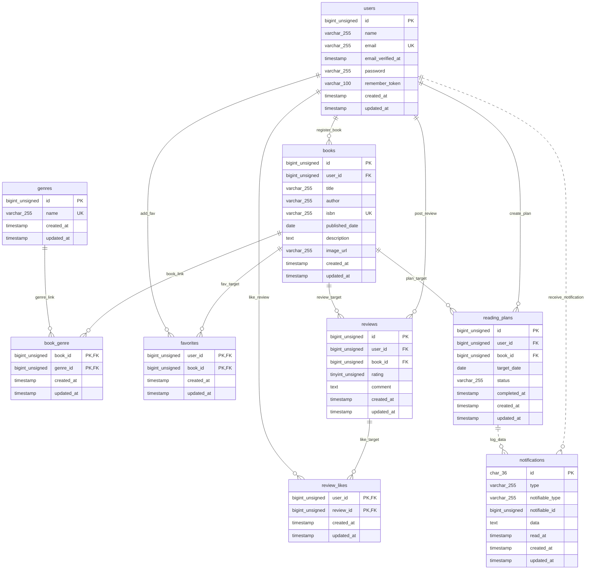

# BookShelf 書籍レビューアプリ

## 1. 作成者

- **氏名**: 谷口 俊明

## 2. 概要

ユーザーが書籍の登録・検索・閲覧、レビュー投稿、お気に入り登録や読書計画の管理を行える書籍レビューアプリケーションです。
一般ユーザー向けのWebアプリケーション機能に加え、外部連携用の公開REST APIを搭載しています。

### 主な機能

- **ユーザー認証機能**: 新規会員登録、ログイン、ログアウト（Laravel Fortify）
- **書籍管理機能**: 書籍の登録・詳細表示・編集・削除、所有者認可制御
- **高度な検索・フィルタ機能**: キーワード検索、ジャンル絞り込み、並び順変更
- **ISBN自動入力機能**: 13桁のISBNコードによるGoogle Books API連携とフォーム自動補完
- **ジャンル管理機能**: ジャンル一覧・詳細表示、登録・編集・削除
- **レビュー・評価機能**: 5段階評価およびコメント投稿・編集・削除
- **お気に入り・いいね機能**: 書籍のお気に入り登録・解除、レビューに対するいいねトグル動作
- **ランキング機能**: レビュー平均評価順に基づくTOP10表示
- **マイ読書レポート機能**: 読書統計、評価分布、高評価書籍TOP5等のダッシュボード表示
- **読書計画・通知機能**: 読書目標期日の管理、日次バッチによる自動失効処理およびリマインダー通知
- **公開API**: 書籍情報のCRUD操作およびSanctumによるトークン認証

## 3. 使用技術

- **バックエンド**: PHP 8.5, Laravel 10.x
- **データベース**: MySQL 8.4
- **フロントエンド**: Vite, Tailwind CSS 3.4, Alpine.js
- **開発・実行環境**: Docker, Docker Compose, Laravel Sail, phpMyAdmin
- **認証パッケージ**: Laravel Fortify（Webセッション認証）, Laravel Sanctum（APIトークン認証）
- **コード品質・テスト**: Laravel Pint (PSR-12フォーマット), PHPUnit / Laravel Testing framework

## 4. ER図



## 5. 環境構築手順

第三者がゼロからローカル開発環境を立ち上げるための手順です。

### 1. リポジトリのクローンと移動

```bash
git clone <repository-url>
cd bookshelf-app
```

### 2. 環境変数ファイルの準備

```bash
cp .env.example .env
```

### 3. Docker (Laravel Sail) コンテナの起動

```bash
./vendor/bin/sail up -d
```

### 4. Composerパッケージのインストール

```bash
sail composer install
```

### 5. アプリケーションキーの生成

```bash
sail artisan key:generate
```

### 6. データベースマイグレーションおよび初期データの投入（シーディング）

```bash
sail artisan migrate:fresh --seed
```

### 7. NPMパッケージのインストールとフロントエンドアセットのビルド

```bash
sail npm install
sail npm run build
```

## 6. 開発環境URL

- **Webアプリケーション**: http://localhost
- **phpMyAdmin**: http://localhost:8080
    - ユーザー名: `sail`
    - パスワード: `password`

## 7. APIエンドポイント一覧

公開APIは `/api/v1` プレフィックス配下に定義されています。書き込み系エンドポイント（POST / PUT / DELETE）には Sanctum によるトークン認証（`Authorization: Bearer {token}`）が必要です。

| HTTPメソッド | URI                    | 認証               | 概要                                                                   |
| :----------- | :--------------------- | :----------------- | :--------------------------------------------------------------------- |
| **GET**      | `/api/v1/books`        | 不要               | 書籍一覧取得（キーワード検索・ジャンル絞り込み・ページネーション対応） |
| **GET**      | `/api/v1/books/{book}` | 不要               | 指定IDの書籍詳細取得（ジャンル情報・レビュー一覧含む）                 |
| **POST**     | `/api/v1/books`        | **必要 (Sanctum)** | 書籍新規登録                                                           |
| **PUT**      | `/api/v1/books/{book}` | **必要 (Sanctum)** | 指定IDの書籍更新（所有者認可チェックあり）                             |
| **DELETE**   | `/api/v1/books/{book}` | **必要 (Sanctum)** | 指定IDの書籍削除（カスケード削除・所有者認可チェックあり）             |

## 8. コード品質・テスト実行

### コードフォーマット確認 (Laravel Pint)

```bash
# 自動修正の実行
sail bin pint

# コード規約テストの実行
sail bin pint --test
```

### テスト実行手順 (PHPUnit)

```bash
# 全テストの実行
sail artisan test

# コードカバレッジ率の計測
sail artisan test --coverage
```
