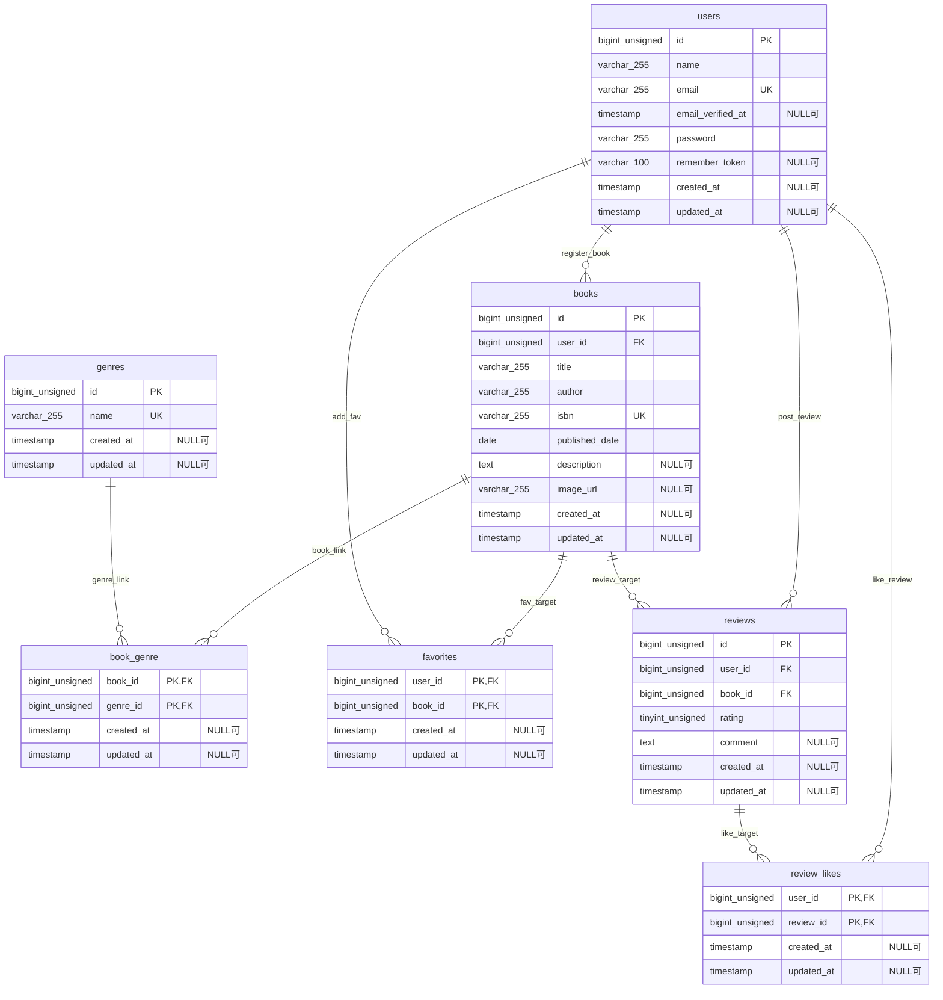

# BookShelf 書籍レビューアプリ

書籍レビューアプリケーション「BookShelf」のバックエンド開発プロジェクトです。
ユーザーは書籍の登録、閲覧、レビューの投稿、お気に入り登録、レビューへのいいね、ジャンル管理、ランキング閲覧を行うことができます。
外部アプリケーション向けに、書籍情報を管理するための公開API（JSON）も提供しています。

本書は基本機能の実装完了に伴い、環境構築、各種仕様、およびAPIエンドポイントの一覧を記述したものです。

## 作成者

谷口 俊明

## 使用技術

- **PHP**: 8.2
- **Laravel**: 10.x
- **MySQL**: 8.4
- **Docker / Docker Compose / Laravel Sail**
- **Vite / Tailwind CSS** ^3.4.0
- **Laravel Fortify**（ユーザー認証）
- **phpMyAdmin**（DB管理ツール：ポート `8080`）

---

## 開発環境URL

- **アプリケーション（Web）**: http://localhost
- **phpMyAdmin**: http://localhost:8080
    - ユーザー名: `sail`
    - パスワード: `password`

---

## 機能一覧（基本機能）

- **ユーザー認証機能** (Laravel Fortify)
    - ユーザー会員登録、ログイン、ログアウト
- **書籍管理機能 (CRUD)**
    - 書籍登録、詳細表示、編集、削除（Policyによる所有者認可制約あり）
- **ジャンル管理機能**
    - ジャンル一覧、書籍が紐づくジャンルの削除制限（ビジネスルール）
- **レビュー機能**
    - 書籍へのレビュー投稿（5段階評価・コメント）、投稿者自身による編集・削除
- **お気に入り機能**
    - 書籍へのお気に入り登録・解除（トグル動作）
- **いいね機能**
    - 他者のレビューに対するいいね登録・解除（トグル動作）
- **ランキング機能**
    - レビュー平均評価順による上位10件の書籍ランキング表示
- **公開API**
    - 外部連携用の書籍CRUD（JSONレスポンス）

---

## ER図

本アプリケーションの基本機能で設計したデータベースのリレーションです。



---

## 環境構築手順

DockerとLaravel Sailを使用してローカル環境を立ち上げます。事前にDocker Desktopがインストールされ、起動していることを確認してください。

### 1. リポジトリをクローン

```bash
git clone https://github.com/alienworldadventurer-debug/bookshelf-app
cd bookshelf-app
```

### 2. .env ファイルの作成と設定

`.env.example` をコピーして `.env` を作成します。

```bash
cp .env.example .env
```

`.env` のDB接続設定が以下になっていることを確認してください（Sailコンテナ内の MySQL を指定）。

```env
DB_CONNECTION=mysql
DB_HOST=mysql
DB_PORT=3306
DB_DATABASE=laravel
DB_USERNAME=sail
DB_PASSWORD=password
```

### 3. Composerのインストール（初回起動用コンテナ経由）

プロジェクトの初回セットアップ時は `vendor` ディレクトリがないため、Sailコンテナ経由で Composer の依存関係を解決します。

```bash
docker run --rm \
  -u "$(id -u):$(id -g)" \
  -v "$(pwd):/var/www/html" \
  -w /var/www/html \
  -e COMPOSER_CACHE_DIR=/tmp/composer_cache \
  laravelsail/php82-composer:latest \
  composer install
```

### 4. Laravel Sailの起動

Dockerコンテナをバックグラウンドで起動します。

```bash
./vendor/bin/sail up -d
```

_(※ M1/M2/M3 MacでMySQLコンテナが正常起動しない場合は、`docker-compose.yml` または `compose.yaml` の `mysql` サービスに `platform: 'linux/amd64'` を追記してください)_

### 5. アプリケーションキーの生成

```bash
./vendor/bin/sail artisan key:generate
```

### 6. データベースのマイグレーションとダミーデータの投入

```bash
./vendor/bin/sail artisan migrate:fresh --seed
```

`UserSeeder` により、以下の5名のログイン可能なテストアカウントが作成されます。

- パスワードはすべて `password` です。
    - 山田太郎 (`yamada@example.com`)
    - 鈴木花子 (`suzuki@example.com`)
    - 田中一郎 (`tanaka@example.com`)
    - 佐藤美咲 (`sato@example.com`)
    - 高橋健太 (`takahashi@example.com`)

### 7. フロントエンドのセットアップとビルド

ViteとTailwind CSSのパッケージを導入してビルドを実行します。

```bash
./vendor/bin/sail npm install
./vendor/bin/sail npm run dev
```

---

## テストの実行とカバレッジ測定

開発した機能（画面アクセス、書籍CRUD、レビュー、お気に入り、いいね、ランキング、Fortify認証、公開APIなど）の自動テストが完備されています。

### テスト実行コマンド

```bash
# 全ての機能テスト・単体テストを実行
./vendor/bin/sail artisan test
```

### テストカバレッジ（カバー率）の測定

カバレッジを測定するには `.env` に `XDEBUG_MODE=coverage` が定義され、コンテナが再起動されている必要があります。

```bash
# ターミナルでカバー率を確認
./vendor/bin/sail artisan test --coverage

# ブラウザ表示用の HTML カバレッジレポートを出力
./vendor/bin/sail artisan test --coverage-html=coverage
```

- **カバー率実績**: **`89.4%`**（基本機能目標 `60%超` に対して、大幅な合格ラインクリアを達成済み）

---

## コード品質とフォーマット（Laravel Pint）

プロジェクト全体のコードスタイルを美しく保つため、PSR-12に準拠した自動整形ツール「Laravel Pint」を導入しています。

```bash
# コード自動整形を実行
./vendor/bin/sail bin pint

# コード規約エラーがないか検証
./vendor/bin/sail bin pint --test
```

検証を実行した際、`No fixable issues were found` と緑色で表示される状態を維持しています。

---

## 公開APIエンドポイント一覧

認証不要の公開APIです。全エンドポイントは `/api/v1` プレフィックス配下に定義されています。
APIのレスポンスは一貫して `{"data": ...}` 構造にラップして返却され、エラー時は適切な HTTP ステータスコード（404, 422など）と日本語エラーメッセージを含む JSON を返します。

| HTTPメソッド | URI                    | 概要                                                                       | 認証 |
| :----------- | :--------------------- | :------------------------------------------------------------------------- | :--- |
| **GET**      | `/api/v1/books`        | 書籍一覧（キーワード・ジャンルIDでの絞り込み、ページネーション対応）       | 不要 |
| **GET**      | `/api/v1/books/{book}` | 指定書籍の個別詳細表示（紐づくジャンル情報・全レビュー詳細をネストで返却） | 不要 |
| **POST**     | `/api/v1/books`        | 新しい書籍の新規登録（バリデーション＋複数ジャンル紐付け）                 | 不要 |
| **PUT**      | `/api/v1/books/{book}` | 指定書籍の情報の更新                                                       | 不要 |
| **DELETE**   | `/api/v1/books/{book}` | 指定書籍の削除（お気に入り・レビューなど関連データも物理削除）             | 不要 |
